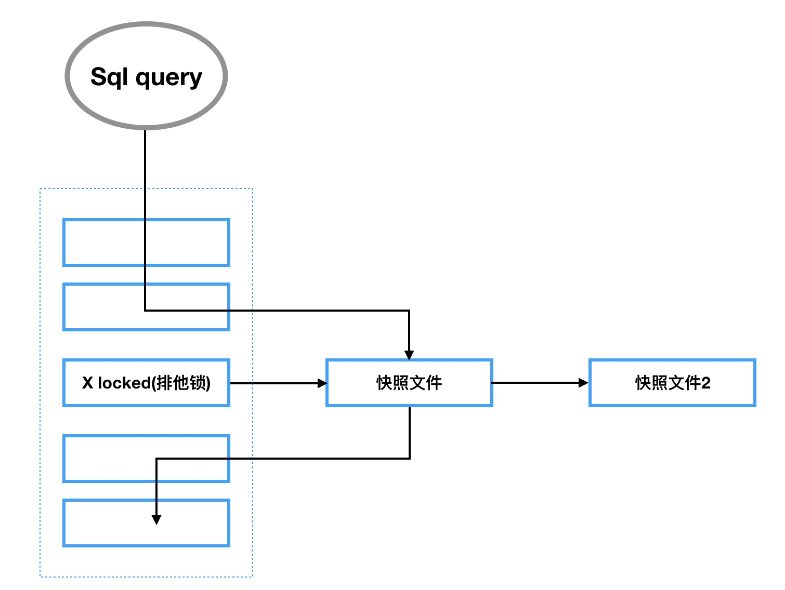
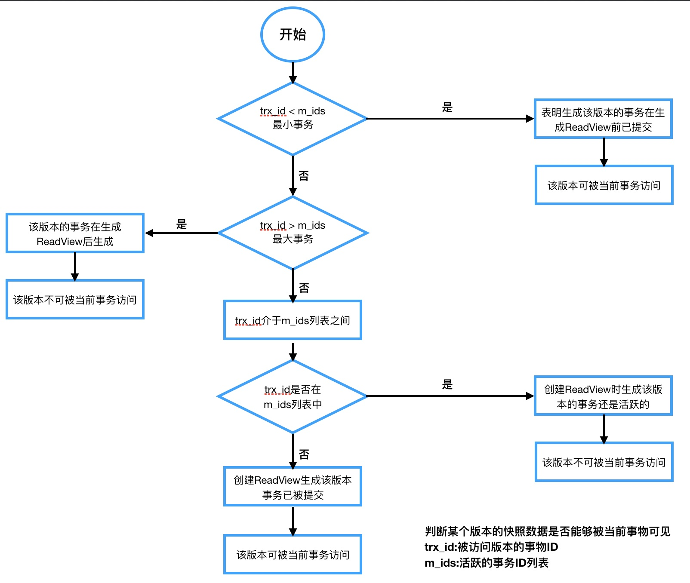

## MVCC(多版本并发控制)原理

#### 一致性非锁定读

一致性非锁定读：指InnoDB存储引擎通过多版本控制的方式来读取当前执行时间数据库中行的数据。如果当前读取的行正在执行update或delete语句时，而此时select操作不会等待行上的锁释放，InnoDB存储引擎会去读取该行的一个快照数据。即写加X(排他锁)读不加锁。

快照数据是该行之前版本的数据，通过undo(回滚日志)来存储，而undo日志是用来做数据回滚，因此快照数据本身不会有太多的额外开销。因为读取快照数据不需要加锁操作，所以一致性非锁定读提高了数据库的并发能力。

InnoDB存储引擎默认的事务隔离级别采用的是一致性非锁定读。

一致性非锁定读示意图如下：




#### 一致性锁定读

一致性锁定读：InnoDB存储引擎默认的事务隔离级别是一致性非锁定读，指某种情况下，用户需要显示的对数据库读取操作进行加行锁以保证数据逻辑的一致性。

InnoDB存储引擎读数据库加一致性锁定读方式如下：

```sql
select * from table for update; -- 对读取的行记录加X Locked(排他锁)，其他事务不能对已锁定的行加任何锁
select * from table lock in share mode; -- 对读取的行加S Locked(共享锁)，其他事务可以给被锁定的行加共享锁，如果加X Locked，会被阻塞
```


#### 什么是MVCC

MVCC：多版本并发控制，指并发控制一行记录的多个快照数据，MVCC是一种乐观锁的实现方式。InnoDB存储引擎中事务隔离级别read committed(读已提交)和Repeatable Read(可重复读)采用的就是MVCC机制进行行读取操作。

Read Committed和Repeatable Read采用MVCC保存快照数据的方式有所不同。Read Committed总是读取锁定行最新的一份快照数据，Repeatable Read读取事务开始时的行快照数据版本。


#### MVCC原理

MVCC基本原理是通过保存数据某个时间点的快照数据来实现的。

**实现策略**：

InnoDB存储引擎的聚簇索引中包含两个隐藏列trx_id和roll_pointer：

```
trx_id:每次对某条聚簇索引记录的行进行改动时，都会把对应的事务ID赋值给trx_id；
roll_pointer:每次对某条聚簇索引记录进行改动时，都会把旧的版本写入到undo日志中，roll_pointer相当于一个指针，可以通过它来定位该记录修改前的信息；
```

1.版本链

每次对记录改动都会记录一条undo日志，每条undo日志都有一个roll_pointer属性，roll_poiner将历史undo日志连接起来串成一个链表，即版本链。(注：insert操作undo日志没有roll_pointer属性，因为新插入的记录没有更早版本)。

2.ReadView

ReadView包含当前系统中还有哪些活跃的读写事务，把它们的事物ID放在一个列表中，列表名称m_ids。ReadView需要判断一下版本链中的哪个版本是当前事物可见的。

Read Committed和Repeatable Read生成ReadWiew时间不同，Read Committed是在每次读取数据前都生成一个ReadView，而Repeatable Read是在事务第一次读取数据时生成一个ReadView。

判断记录的某个版本快照数据能否被当前事物访问方式：若trx_id的值大于m_ids列表或在m_ids列表中，则表示该版本快照数据不能被当前事务访问，否则可被访问。




#### 为什么使用MVCC

不同的事务在并发场景下，select可以不加锁而是通过MVCC机制读取指定的版本历史记录，并通过一些手段保证读取的记录符合事务所处的隔离级别，从而解决并发场景下的读写冲突。

MVCC并没有简单的使用InnoDB行锁(inondb_row_lock)，而使用了行级锁(row_level_lock)。提高数据库高并发场景下的吞吐性能。提高数据库处理事务的能力和资源利用率。

#### 示例

| transaction A                     | transaction B                    |
| --------------------------------- | -------------------------------- |
| select x from table; return x = 5 |                                  |
| begin transaction;                |                                  |
| update tabel set x = 8;           |                                  |
|                                   | begin transaction;               |
|                                   | select x from table; return rs1; |
| commit;                           |                                  |
|                                   | select x from table; return rs2; |
|                                   | commit;                          |

在Read Uncommitted、Read Committed和Repeatable Read三种事务隔离级别下rs1和rs2的值分别是多少？

分析：

Read Uncommitted隔离级别rs1=rs2=8，即事务B读取到事务A未提及的数据，产生脏读问题;

Read Committed隔离级别rs1=5 rs2=8 因为Read Committed采用MVCC机制总是读取锁定行最新的一份快照数据，当事务A更新(update)数据为8事务还未提交时，该行记录保存的最新快照数据x=5，rs1的查询时在事务提交前操作，所以查询的结果是5。当事务A提交之后，x=8生成了最新保存的的快照数据，所以rs2=8。产生不可重复读问题。

Repeatable Read隔离级别下rs1=rs2=5 因为Repeatable Read隔离级别采用MVCC机制读取的是事务开始时的快照数据，事务B开始是快照数据保存的数据是x=5，所以在事务B中两次查询的结果都是5。


