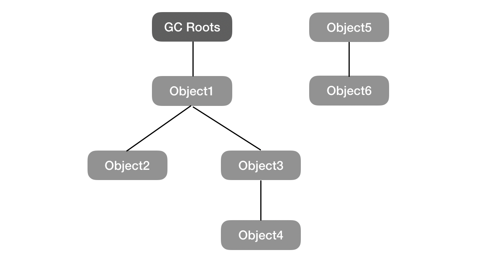

对于线程私有的内存运行时数据区域，如程序计数器、虚拟机栈、本地方法栈等区域会随着线程的创建和销毁而进行创建和销毁。因方法或线程结束时内存也就跟着进行回收，所以就不需要过多考虑内存回收问题。对于堆和方法区中的内存分配都是动态的，所以是垃圾回收重点关注的地方。垃圾收集器对堆内存回收之前需要先判断哪些对象是可以进行回收的哪些是不需要进行回收。

#### 判断对象是否可以回收算法

- 引用计数法

  原理：给对象中添加一个引用计数器，每当有一个地方引用它时计数器就加1，当引用失效时就减1，当任何时候引用计数器为0时表示该对象不可能在被使用。

  优点：实现简单，判定效率较高。

  缺点：无法解决对象之间相互循环引用的问题。

  例如：对象A和对象B中存在对象之间相互引用，除此之外这两个对象再无其他任何引用，即这两个对象不会在被其他地方引用，但因为对象A和对象B之间相互引用导致它们引用计数器的值不为0，通过引用计数算法无法通知垃圾回收器进行回收。

  

- 可达性分析算法

  原理：通过一系列的GC Roots的对象作为起始点，从GC Roots节点开始往下搜索。当一个对象到GC Roots没有任何的引用链相连，则证明此对象不可用。即当一个对象无法通过引用链到达GC Roots，则判定该对象为可回收的对象。

  优点：可以解决引用计数法中对象相互循环引用的问题。例如：对象A和对象B之间相互引用，但对象A和对象B都无法通过引用链到达GC Roots，则表示对象A和对象B可以进行内存回收。

  可达性分析算法是Java中判断对象是否存活所使用的算法。

  

#### 可作为GC Roots的对象有哪些？

- 虚拟机栈中引用的对象(栈帧中的本地变量表)；
- 方法区中类静态属性引用的对象；
- 方法区中常量引用的对象；
- 本地方法栈中JNI的引用对象(即一般指的是native方法)；

#### 判断对象是否真正的可以被回收的流程

通过可达性分析算法判断对象是否需要回收至少需要通过两次标记的过程：

1. 对象在通过可达性分析之后发现没有和GC Roots相连的引用链，则会进行第一次标记并进行一次筛选，筛选条件是判断该对象是否有必要执行finalize()方法，当该对象没有覆盖finalize()或finalize()已经被虚拟机调用过，虚拟机则认为没必要执行，对象被回收。
2. 如果对象判定为有必要执行finalize()方法，则该对象会放入F-Queue队列中，稍后虚拟机会自动创建一个低优先级的Finalizer线程去执行它。finalize()方法是对象逃脱死亡的最后一次机会，GC会对F-Queue进行第二次标记，如果待标记的对象和GC Roots重新建立了引用链，则在第二次标记的时候将该对象移除即将回收的集合，若对象没有逃脱则基本就会被回收了。

#### 为什么finalize()方法被调用过JVM就会判断没必要在执行该方法？

因为JVM中对象的finalize()方法只能被调用一次。

***注：***在对象被判定有必要执行finalize()方法时，虚拟机会自动创建一个低优先级的Finalizer线程去执行它，这个执行是指虚拟机会触发这个方法，但并不会等待它运行结束，原因是如果一个对象在finalize()方法执行缓慢或发生死循环，很可能会导致F-Queue队列中其他对象永久处于等待，甚至导致整个内存回收崩溃。

