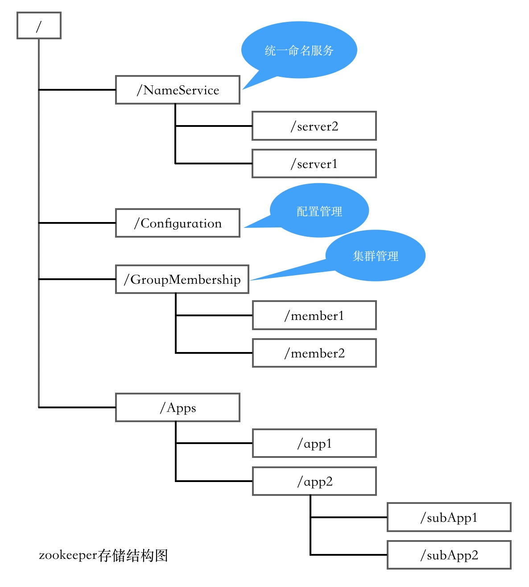
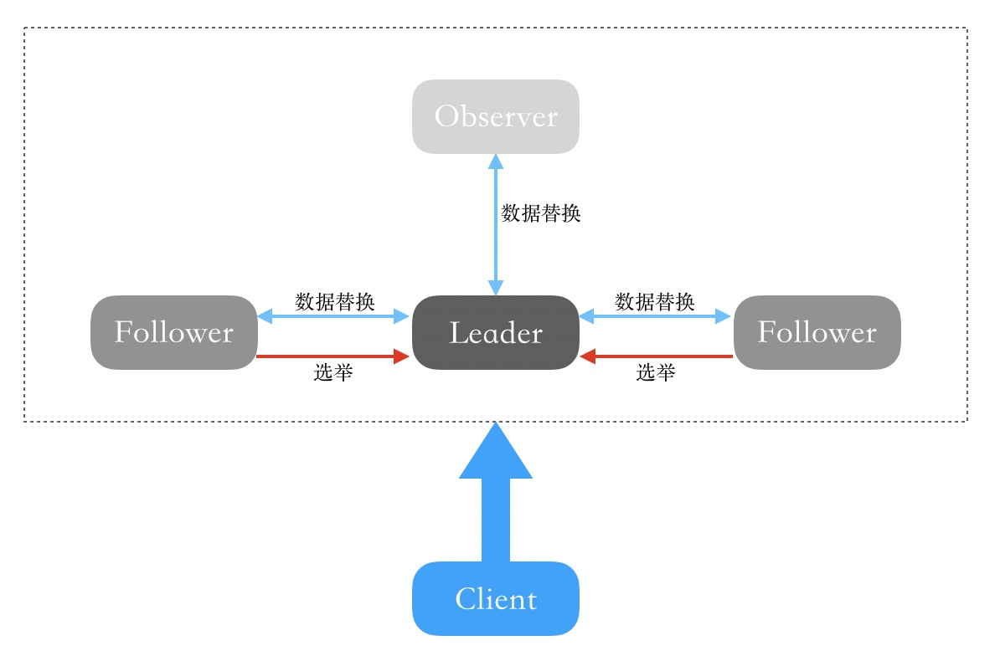

## 什么是zookeeper？zookeeper节点(znode)有几种类型？zookeeper集群架构。

#### 1.什么是zookeeper？

zookeeper类似于文件系统的数据结构，为解决分布式集群中应用系统的一致性问题，主要用于统一命名服务、配置管理、集群管理、分布式应用配置项等。zookeeper相当于一个文件系统+监听通知机制。

- 每个子目录被称为一个节点(znode)，如：上图中NameService就是一个目录节点。znode是它所在路径的唯一标识；
- znode可以自由增加、删除，也可以在znode下增加或删除子znode。znode是用于存储数据的；
- EPHEMERAL类型的目录节点不能够创建子节点目录；
- 每个znode中存储的数据可以有多个版本，即一个访问路径可以存储多份数据；
- zookeeper客户端和服务端是采用长连接方式，每个客户端和服务端是通过心跳来保持连接的，这个连接状态被称为session，如果session失效临时节点就会被删除；
- zone的目录名可以自动编号，每次随数据变化自增；
- zookeeper核心特性是znode可以被监控，即存储这个目录节点的数据被修改、子目录节点的变化等，可以通知设置监控的客户端；

#### 2.znode有几种类型？

znode节点四种类型：

- 持久化节点(PERSISTENT)：客户端与zkserver断开之后，节点依旧存在；
- 持久化顺序编号节点(PERSISTENT_SEQUENTIAL)：客户端与zkserver断开之后，节点依旧存在，只是zkserver会给该节点名称进行顺序编号；
- 临时节点(EPHEMERAL)：客户端与zkserver断开之后，节点会被删除；
- 临时顺序编号节点(EPHEMERAL_SEQUENTIAL)：客户端与zkserver断开之后，节点会被删除，只是zkserver会给该节点名称进行顺序编号；

#### 3.zookeeper集群

zk集群是基于主从复制，包含leader、follower、observer三个角色。

- leader：用于发起和维护与follower、observer之间的心跳；写操作必须有leader来进行处理，再由leader广播给其他server；
- follower：用于直接处理client的读操作并返回结果；将client发起的写操作转发给leader处理，参与leader选举的投票；
- observer：功能类似于follower，但没有投票权；目的是保证系统的可伸缩性且不影响吞吐率；

leader、follower、observer三个角色都可以处理客户端的读请求并返回结果，但follower和observer接收到客户端的写请求时只能转发给leader进行处理，然后有leader进行广播发送个follower和observer。

zk集群主从架构是基于ZAB协议来保证各个server之间副本数据的一致性，从而保证了写操作的一致性和可用性。[ZAB协议](./20191218_zookeeper_zab_protocol.md)

