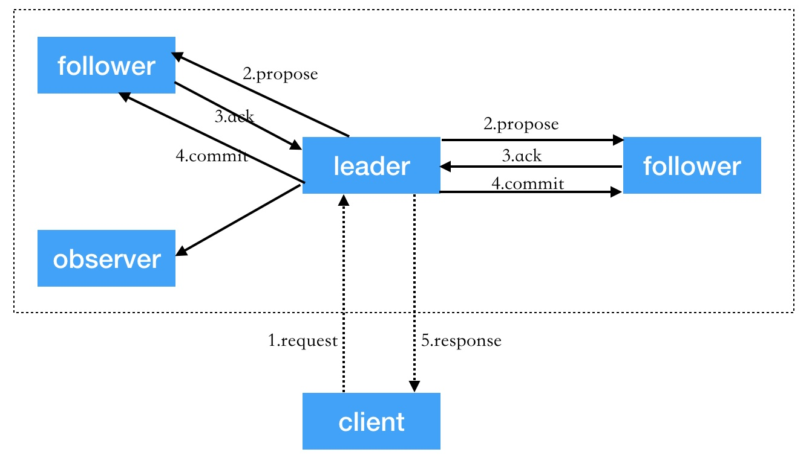

## 什么是ZAB协议？

zookeeper核心实现是原子广播协议，即ZAB协议。zookeeper集群主从模式是通过ZAB协议保证各个副本之间的数据一致性。

ZAB协议的设计目标是建立一个高可用、可扩展分布式数据主备系统。在任意时刻leader宕机也能够保证分布式系统数据的可靠性和最终一致性。

ZAB协议主要包括恢复模式和广播模式两种模式，当服务启动或leader崩溃之后，ZAB协议就进入恢复模式。leader被选举出来且大多数follower与leader状态同步之后，恢复模式结束。状态同步保证了leader和follower具有相同的系统状态。

ZAB协议分为三个阶段：选举--->恢复--->广播

- 选举：从所有server中选出一个leader，只要有一个server通过选举机制获得超过半数的投票票数就会当选为leader；
- 恢复：followers和leader进行进行状态同步，当大多数节点同步完成，恢复模式结束；
- 广播：zookeeper集群开始对外提供事务服务，leader进行消息广播；

**ZAB协议操作流程：**

1.通过leader进行写操作流程

- 客户端向leader发送写请求；
- leader将写请求以propose(提议)形式发给所有的followers并等待follower的ack;
- follower收到leader的propose后返回ack；
- leader得到过半数的ack后向所有的follower和observer发送commit(leader对自己默认有一个ack)；
- leader将处理结果返回给客户端；

2.通过follower和observer进行写操作流程

follower和observer可以接收客户端的写请求，但是需要转发给leader进行写处理。follower和observer操作步骤相似，只是多了一步转发leader的步骤。

3.读操作

leader、follower、oberser都可以直接处理客户端的读请求，且从本地内存中读取数据并返回给客户端。